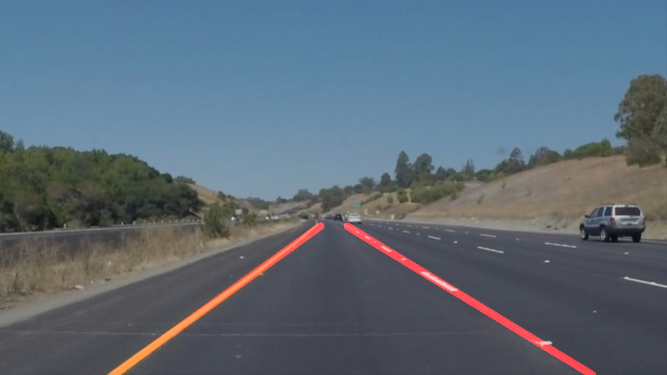

# **Finding Lane Lines on the Road** 

---

**Finding Lane Lines on the Road**

The goals / steps of this project are the following:
* Make a pipeline that finds lane lines on the road
* Reflect on your work in a written report

[//]: # (Image References)

[image1]: ./examples/grayscale.jpg "Grayscale"

---

### Reflection

### 1. Describe your pipeline. As part of the description, explain how you modified the draw_lines() function.

My pipeline consisted of 5 steps:

1. Convert the image to grayscale
2. Use a Gaussian blur
3. Use the Canny method to extract the edges
4. Mask the edges falling out of a region of interest
5. Extract the lines with the Hough transformation
  
In order to draw a single line on the left and right lanes, I modified the draw_lines() function.
For each segment, I compute its slope and intercept.
If the slope is negative, then I consider this segment to be on the right line.
Otherwise to be on the left line.
Then I compute the average slope and intercept for each line before drawing it from the bottom all the way to the highest segment.

If you'd like to include images to show how the pipeline works, here is how to include an image: 

### 2. Identify potential shortcomings with your current pipeline

One potential shortcoming would be when there is a corner. Then the extrapolation in draw_lines would not work anymore, since the slopes would be very different. There would also be some issues with the road, not falling within the region of interest anymore.

Another shortcoming could be in case of the vehicle not being in the center of the lane. Then the region of interest would not cover the lanes.

### 3. Suggest possible improvements to your pipeline

A possible improvement to the curved lines issue would be to refine the extrapolation method, so as to fit a parabolic curve through all the lines.
